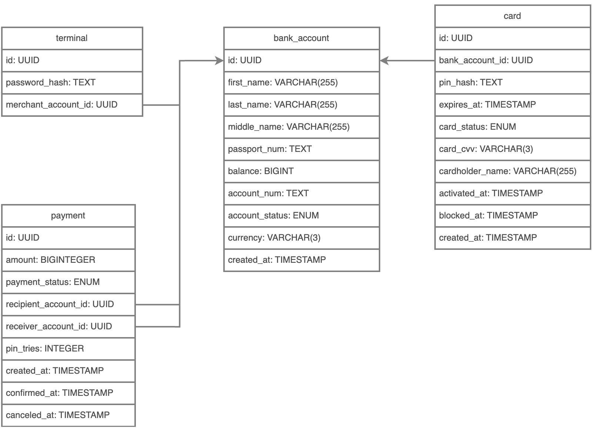
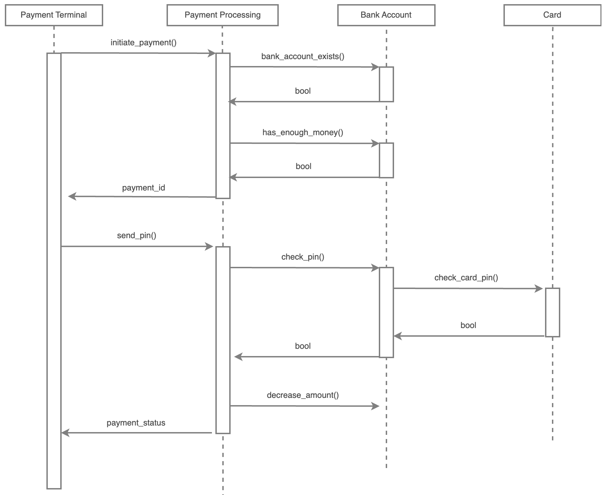

# Payment Processing API example


## Table of Contents
- [Introduction](#-introduction)
- [Used technologies](#-used-technologies)
- [How it works](#-how-it-works)
- [Architecture](#-architecture)
- [Deployment](#-deployment)
- [API Documentation](#-api-documentation)

## Introduction
Robust RESTful API using `Node.js` and `Express.js` for payment
processing platform. The API handles transactions securely
and efficiently, with authentication using `JSON Web Tokens (JWT)`.
The application is integrated with a `PostgreSQL` database
to store transaction data.

## Used technologies

`Node.js`, `Express.js`, `PostgreSQL`, `Docker`, `Nginx`, `Ubuntu OS`


## How it works

<div style="display: flex; justify-content: center; width: 100%;">
  
</div>

<br>

<div style="display: flex; justify-content: center; width: 100%;">
  
</div>

## Architecture

Clean Architecture is a software design philosophy that emphasizes 
the separation of concerns to make systems more flexible, 
maintainable, and testable. The core idea is to structure your 
system in layers, where the inner layers contain business rules and 
logic, while outer layers handle external concerns such as databases, 
UI, or frameworks. The system's core is independent of external 
technologies, making it easier to adapt and change parts of the 
system without affecting the whole.

<div style="display: flex; justify-content: center; width: 100%;">
  
</div>

```
src                                 → Application sources 
  └ application                     → Application services layer
       └ repositories               → Repository interfaces
       └ use_cases                  → Application business rules 
  └ controllers                     → Route handlers
  └ domain                          → Enterprise core business layer such as domain model objects (Entities, Value Objects)
       └ entities                   → Core business model objects
       └ services                   → Core business logic
  └ infrastructure                  → Frameworks, drivers and tools such as Database, the Web Framework, mailing/logging/glue code etc.
       └ database                   → Database ORM models and Repository implementations
          └ models                  → ORM models
          └ repositories            → Implementation of domain repository interfaces
       └ webserver                  → Express.js Web server configuration (server, routes etc.)
          └ middleware              → Middlwares for authenticating, validating etc.
          └ routes                  → Server routes
          └ schemas                 → Schemas for validating incoming data

 └ node_modules (generated)         → NPM dependencies
 └ app.js                           → Main application entry point
```

## Deployment

The system is deployed on Ubuntu server using Docker. API is accessible with this [link](http://simplify.kg:8080).
Run the following command to run the system locally:
```sh
docker-compose up -d
```

## API Documentation
| Method | URL                            | Description                       |
|--------|--------------------------------|-----------------------------------|
| `POST` | `/api/v1/terminals/jwt-create` | Getting JWT tokens for terminals. |

#### Data expected in body:

```
{
    "terminal_id": int,
    "password": str,
}
```

#### Successful response:

```
HTTP/1.1 200 OK

{
    "access_token": str,
    "refresh_token": str
}
```
| Method | URL                             | Description                          |
|--------|---------------------------------|--------------------------------------|
| `POST` | `/api/v1/terminals/jwt-refresh` | Refreshing JWT tokens for terminals. |

#### Data expected in body:

```
{
    "refresh_token": str
}
```

#### Successful response:

```
HTTP/1.1 200 OK

{
    "access_token": str,
    "refresh_token": str
}
```

| Method | URL                                 | Description                                                                           |
|--------|-------------------------------------|---------------------------------------------------------------------------------------|
| `POST` | `/api/v1/payments/initiate-payment` | Initialization of payment. Terminals send this request when a user puts a debit card. |

#### Data expected in body:

```
{
    "amount": int,
    "sender_account_id": int,
    "recipient_account_id": int
}
```

#### Successful response:

```
HTTP/1.1 200 OK

{
    "id": int,
    "amount": int,
    "sender_account_id": int,
    "recipient_account_id": int
}
```

| Method | URL                                             | Description                                     |
|--------|-------------------------------------------------|-------------------------------------------------|
| `POST` | `/api/v1/payments/confirm-payment/{payment_id}` | Confirm initialized payment with PIN of a card. |

#### Data expected in body:

```
{
    "card_pin": str
}
```

#### Successful response:

```
HTTP/1.1 200 OK

{
    "id": int,
    "amount": int,
    "sender_account_id": int,
    "recipient_account_id": int
}
```

#### Bank accounts, terminals for testing

```
Bank accounts: 
id: 1, pin: "1234"
id: 2, pin: "1111"
id: 3, pin: "2222"

Terminals:
id: 1, password: testterminal1
id: 2, password: testterminal2
id: 3, password: testterminal3

Some of bank accounts do not have enough money so that you can see errors
```